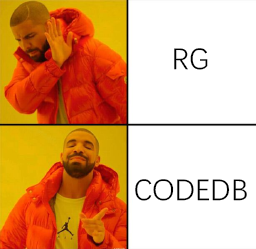

# UnityCodeDB

<p align="center">
  
</p>

<p align="center"><sub>"Memes Comment Reply" icon by <a href="https://streamlinehq.com">Streamline</a>, licensed under <a href="https://creativecommons.org/licenses/by/4.0/">CC BY 4.0</a>.</sub></p>

UnityCodeDB is an Editor-only Unity Package Manager package for project-local
CodeDB setup, indexing, health checks, automatic refresh, and bounded source
discovery from Codex or another MCP client.

The current release targets Unity `2022.3` on Windows. It keeps every generated
index, provider binary, log, and watcher state inside the consuming Unity
project's ignored runtime instead of sharing state across projects.

<p align="center">
  
</p>

## Package

- Package name: `com.rice.ai-codedb`
- Latest stable release: `v0.2.4`
- Latest validation prerelease: `v0.2.5-preview.3` / `poc.30`
- Unity: `2022.3` or newer within the `2022.3` compatibility line
- Editor menu: `Tools/Rice AI/Codedb/Manager`

## Installation

For the current third-party validation, add the preview package to the Unity
project's `Packages/manifest.json`:

```json
{
  "dependencies": {
    "com.rice.ai-codedb": "https://github.com/riceWithoutIce/UnityCodeDB.git?path=/com.rice.ai-codedb#v0.2.5-preview.3"
  }
}
```

Production projects should remain pinned to stable `v0.2.4` until the preview
is accepted. Use `#main` only when intentionally validating unpublished changes.

## Requirements

- Windows Editor and Windows PowerShell 5.1
- Node.js for the project-local MCP wrapper and Shader/HLSL adapter worker
- A separately acquired `killop/codedb-mcp` / `codebase-mcp` provider

The provider is an external process dependency. This repository does not
vendor its source or redistribute its binary.

## First Setup

1. After Unity resolves the Package, an empty safe CodeDB scope converges to the
   current Host generation automatically. This behavior is independent of the
   project's version-control system and the Package installation source.
2. Open `Tools/Rice AI/Codedb/Manager` to inspect project status.
3. If recovery is needed, click `Repair CodeDB` and confirm its exact
   project-local scope. That one action repairs the Host runtime and only the
   current project's MCP server section; it does not require an authorization
   file, copied registration snippet, or manual TOML edit.
4. Provide the separately acquired external provider when the Setup view asks
   for it.
5. If Setup reports `REDEPLOY_REQUIRED`, stop CodeDB, disconnect project MCP
   sessions, and use `Redeploy host`. The action replaces only byte-exact
   package-owned legacy Host files, regenerates the ignored runtime config, and
   preserves Provider binaries, indexes, adapters, MCP registration, and
   unrelated project files.
6. After Setup completes, each interactive Unity Editor session publishes
   project demand and starts CodeDB asynchronously. `Start with Unity Editor`
   controls the persistent policy; Start, Stop, and Restart control the Editor
   session cohort present when the command is issued without silently changing
   that policy.
7. Closing the final Editor session stops that project's backend without
   changing its preference. BatchMode sessions do not auto-start CodeDB.

## Ownership Boundaries

- The package owns reusable Editor UI, validation, adapters, templates, and
  payload tooling under `com.rice.ai-codedb/`.
- Unity's resolved Package location is read-only input. Cached, local, embedded,
  and registry-backed installations use the same project state machine.
- Each Unity project owns tracked operational files under `AIWork/codedb/`.
- Generated runtime stays under ignored
  `AIWork/.runtime/codedb/<project-provider-slug>/`.
- Immutable host generations, their atomic pointer, and generation leases stay
  under ignored `AIWork/.runtime/codedb/host/`.
- MCP registration is workspace-local or project-level first. The package does
  not silently edit global client configuration.
- Provider watch and the Shader/HLSL text adapter remain separate owners.
- `codedb_read` resolves a project-local real file, returns at most 200
  requested lines, and all wrapper text responses are capped at 64 KiB.
- Search `path` aliases are normalized to `path_glob`; directory queries without
  a language merge Provider and Shader hits under one deduplicated global limit.
- Ready MCP wrappers share the project coordinator's persistent Provider. The
  v0.2.3 bridge stays dormant with zero Provider attempts while Unity is
  offline and reattaches after Unity returns without recreating the MCP session.
  Identical concurrent searches join one execution; distinct work is queued
  without implicit batching. Disabled, Editor-offline, and starting states do
  not launch a Provider and return a stable reason instead.

See [the package README](com.rice.ai-codedb/README.md) and
[package documentation](com.rice.ai-codedb/Documentation~/index.md) for the
full safety and materialization model.

## Repository Layout

```text
com.rice.ai-codedb/
  Editor/          Unity Editor implementation
  Tests/Editor/    Unity EditMode tests
  Payload~/        Audited host-project payload
  Tools~/          Host payload materializer
  Tests~/          Standalone materializer fixture
  Documentation~/ Package documentation
```

## Validation

Run the standalone package boundary fixture from the repository root. During
development, select the materializer slice that matches the changed behavior:

```powershell
powershell -NoProfile -ExecutionPolicy Bypass -File .\com.rice.ai-codedb\Tests~\test-codedb-package-boundary.ps1
powershell -NoProfile -ExecutionPolicy Bypass -File .\com.rice.ai-codedb\Tests~\test-codedb-host-payload-materializer.ps1 -RepairOnly
powershell -NoProfile -ExecutionPolicy Bypass -File .\com.rice.ai-codedb\Tests~\test-codedb-host-payload-materializer.ps1 -TransactionOnly
powershell -NoProfile -ExecutionPolicy Bypass -File .\com.rice.ai-codedb\Tests~\test-codedb-host-payload-materializer.ps1 -PortabilityOnly
```

The materializer selectors are mutually exclusive. After the implementation
tree is stable, run the complete fixture once as the release-candidate gate:

```powershell
powershell -NoProfile -ExecutionPolicy Bypass -File .\com.rice.ai-codedb\Tests~\test-codedb-host-payload-materializer.ps1
```

## License

UnityCodeDB is released under the [MIT License](LICENSE). Third-party tools are
not bundled and remain governed by their own licenses.
